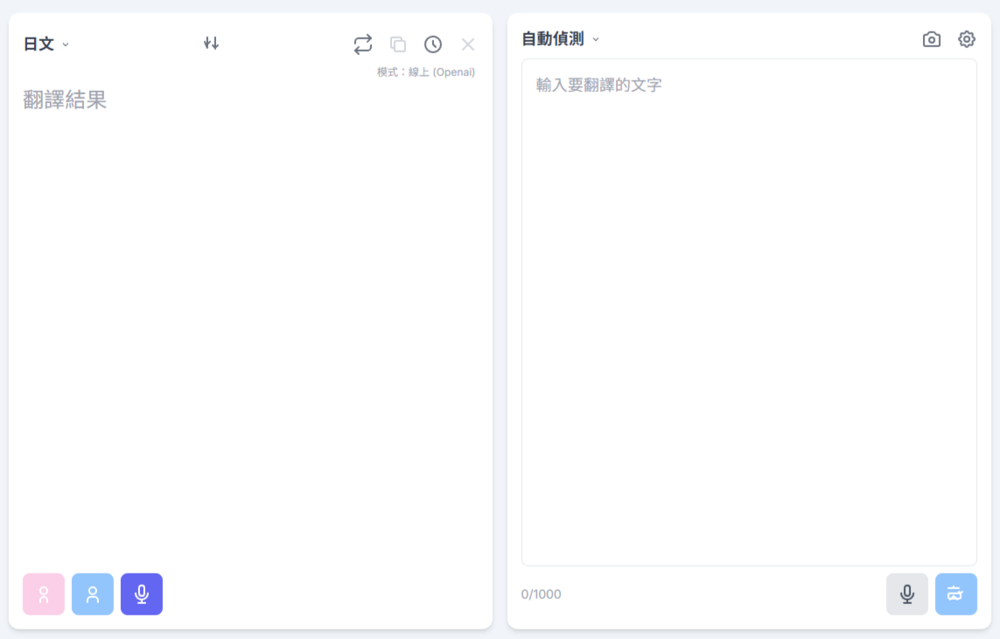

<div align="center">

</div>

# Run and deploy your AI Studio app

This contains everything you need to run your app locally.

View your app in AI Studio: https://ai.studio/apps/drive/1uA68LGio1CJePNXz2emCcow0SASjOXf4

## Run Locally

**Prerequisites:**  Node.js


1. Install dependencies:
   `npm install` or `yarn install`  
2. Run the app:  
   `npm run dev` or `yarn run dev`
3. Open Chrome or Edge and enter `chrome://flags/`, find `Insecure origins treated as secure` and enter the local server IP to bypass security check to use WebGPU.  
Example: http://192.168.31.92:3000,192.168.31.92:3000,http://localhost:3000

# Gemini AI Translator

This is a modern translation application powered by the Google Gemini API. It provides a clean, mobile-first user interface for fast and accurate text, voice, and image translation between multiple languages, and supports both online and offline modes.  
🚀[Live Demo](https://willo83417.github.io/Gemini-AI-Translator-offline/ "Gemini AI Translator")  

## 📸 Screenshots

<div align="center">
  <table>
    <tr>
      <td align="center">
        
      </td>
      <td align="center">
        
      </td>
      <td align="center">
        
      </td>
      <td align="center">
        
      </td>
    </tr>
    <tr>
      <td align="center">
        
      </td>
      <td align="center">
        
      </td>
      <td align="center">
        
      </td>
      <td align="center">
        
      </td>
    </tr>
  </table>
</div>

## Design Features

### Core Translation Functionality💬
- **Text Translation**: Supports real-time streaming translation, displaying the translation result immediately as you input text.
- **Speech Translation**:
  - **General Recording**: Converts the user's voice into text and fills in the input box.
  - **Real-time Speech Translation (AST)**: Directly translates the user's voice into the target language and displays it as text, achieving a more fluid conversation-style translation.
- **Image Translation**: Through the device camera or importing images from the album, the application can automatically detect and extract text from images and then translate it.

### Online and Offline Modes🌐
- **Online Mode**: Utilizes a powerful cloud AI model (Gemini or OpenAI) for high-quality translation. This mode requires network connection and valid API keys.
- **Offline Mode**: Translates using the Gemma model downloaded locally on the device (run through MediaPipe). Offline mode supports text, voice-to-text, and image text extraction.

### Multilingual Support🌟
The application supports a variety of mainstream languages, including English, Traditional Chinese, Simplified Chinese, Japanese, Korean, Spanish, etc., and provides "automatic detection" of the source language.

### Personalization Settings🔒
- **API Keys and Model Management**: Users can input their own Gemini or OpenAI API keys and customize the model names they want to use.
- **Offline Model Download**: Provides an interface to download, manage, and delete local models for offline mode.
- **Offline Text-to-Speech (TTS)**: Users can customize the voice, speed, and pitch of offline TTS for a personalized listening experience.
- **High Accuracy Japanese to Chinese Translation Mode**: For Japanese translation to Chinese scenarios, a special "two-step translation" mode (JP → EN → CN) is provided to enhance translation accuracy and fluency.

### History Record📊
Automatically saves the last 50 translation records for users to view and reuse at any time.

## Document Structure🏗

- `/` (root directory): Contains the entry point and main configuration files for the project, such as `index.html`, `index.tsx`, `package.json`, `vite.config.ts`.
- `/components`: Stores all React UI components. Each component is responsible for rendering and interacting with a portion of the UI.
  - `TranslationInput.tsx`: Source language input interface.
  - `TranslationOutput.tsx`: Target language output interface.
  - `SettingsModal.tsx`: Settings pop-up window.
  - `HistoryModal.tsx`: History record pop-up window.
  - `CameraView.tsx`: Camera translation interface.
- `/services`: Stores the application's core business logic, particularly for interacting with APIs and backend services.
  - `geminiService.ts`: Handles all communication with the Google Gemini API.
  - `openaiService.ts`: Handles all communication with the OpenAI API.
  - `offlineService.ts`: Manages the loading and execution of local MediaPipe models.
  - `downloadManager.ts`: Responsible for downloading, pausing, resuming, and deleting offline models.
- `/types.ts`: Defines the TypeScript types used throughout the application.
- `/constants.ts`: Stores application constants, such as supported language lists, offline model information, etc.
- `/i18n.ts`: i18next internationalization configuration file, manages multilingual interfaces.

## UI Feature Explanation

### Main Interface
The main interface is divided into two blocks, one for input and one for output.

- **Source Language Block (`TranslationInput`):**
  - **Text Input Area**: For inputting or pasting the text to be translated.
  - **Language Selector**: Select the source language, with automatic detection supported.
  - **Function Buttons**:
    - `Translate`: Execute the translation.
    - `Record`: Activate the microphone for voice input.
    - `Camera`: Open the camera for image translation.
    - `Settings`: Open the settings window.
  - **Status Display**: Displays the character count and current network connection status (online/offline).
  
- **Target Language Block (TranslationOutput)**:
  - **Translation Result Display**: Displays the translated text.
  - **Language Selector**: Select the target language.
  - **Function Buttons**:
    - **Swap Languages**: Quickly swap the source and target languages.
    - **Flip Screen**: Mirror the text in this block for easy display to someone across from you.
    - **Copy**: Copy the translation result to the clipboard.
    - **History**: Open the history window.
    - **Clear**: Clear the translation result.

  - **Text to Speech (TTS)**: Provides male and female voice (or custom voice) buttons to read the translation result aloud.

  - **Real-time Speech Translation (AST)**: When activated, it translates speech input into the target language.

### Pop-up windows
- **Settings (`SettingsModal`)**:
  - **Online Pages**: Set API keys, service providers (Gemini/OpenAI), and model names.
  - **Offline Pages**: Manage Hugging Face API keys, download/delete offline models, enable offline mode, and high-accuracy mode during the day.

- **History (`HistoryModal`)**: Displays a list of past translation records, which can be clicked to reload.

- **Camera (`CameraView`)**:
  - Provides a real-time preview of the camera.
  - Controls include: taking a photo, importing from the gallery, flash switch, and focus zoom.

## Technical Stack🚀

- **Frontend Framework**: React
- **Language**: TypeScript
- **Build Tool**: Vite
- **Styles**: Tailwind CSS
- **Offline Models**: Google Gemma
- **Offline Inference Engine**: MediaPipe (`@mediapipe/tasks-genai`)
- **Online Translation**: Google Gemini API (`@google/genai`) / OpenAI API
- **Internationalization**: i18next  

## Task allocation:📖  
[**LOGO - Design**]：NanoBanana  
[**AI Studio - Gemini 2.5Pro**]：80% (Most UI, code design)  
[**Copilot -in Edge**]：10% (Resolve Gemini 2.5 Pro errors that cannot be handled)  
[**Human**]：10% (Propose concepts, testing, Debug)  
## Notes⚠️
## GitHub Pages settings  
1. Modify package.json
   ```
   "homepage": "https://<your-github-username>.github.io/repository name", ← Add this
   "deploy": "gh-pages -d dist", ← Add this  
   ```
2. Modify vite.config.ts
   ```
   base: '/repository name/', // ← Add this
   plugins: [],
   ```
   ```
           icons: [
          {
            "src": "images/icon-192.png", ←Modify "images/icon-192.png" not "/images/icon-192.png"
            "sizes": "192x192",
            "type": "image/png",
            "purpose": "any maskable"
          },
          {
            "src": "images/icon-512.png", ←Modify "images/icon-512.png" not "/images/icon-512.png"
            "sizes": "512x512",
            "type": "image/png"
          }
        ]
   ```
3. Install gh-pages  
   `npm install gh-pages --save-dev` or `yarn add gh-pages -D`  
4. Output static website files  
   `npm build` or `yarn build`
5. Run to GitHub Pages  
    `npm run deploy` or `yarn run deploy`
    
